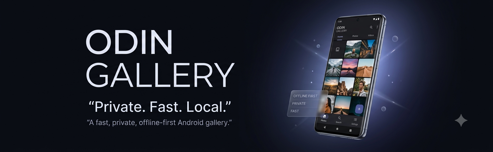

<div align="center">

# 🖼️ Odin Gallery

### A fast, private, offline-first Android gallery.

<p>
  <b>Kotlin • Jetpack Compose • Android Media APIs</b>
</p>

<p>
  <a href="https://github.com/odincalm">
    
  </a>
  <a href="https://www.instagram.com/odincalm0">
    
  </a>
</p>

<br>



</div>

---

## ⚡ Odin Gallery

Odin Gallery is a **privacy-focused Android gallery** built around one simple idea:

> Your photos belong on your device.

Odin Gallery is designed to provide a fast, clean and modern way to manage photos and videos while keeping the core gallery experience completely local.

No account is required for the core gallery.

No unnecessary cloud dependency.

No forced AI features.

Just your media, your device and a fast gallery experience.

---

## ✨ Features

| Feature | Description |
|---|---|
| 📱 **Offline First** | Browse and manage photos and videos without an internet connection |
| ⚡ **Smooth Performance** | Optimized scrolling, rendering and media loading |
| 🖼️ **Photos & Videos** | View photos and play videos directly inside the gallery |
| 📁 **Smart Organization** | Media can be organized according to its source folders |
| ❤️ **Favorites** | Quickly access your favorite photos and videos |
| 🗑️ **Recently Deleted** | Restore deleted media or permanently remove it |
| 🔒 **Hidden Media** | Protect private photos and videos behind a lock |
| 📤 **Native Sharing** | Use Android's native system sharing |
| 🌑 **OLED UI** | Dark interface designed for AMOLED/OLED displays |
| 🔐 **Privacy Focused** | Local-first architecture with no unnecessary data collection |

---

## 🎨 Design

Odin Gallery focuses on a modern, minimal and premium Android experience.

The interface combines:

- OLED-friendly dark UI
- Clean layouts
- Smooth animations
- Glass-inspired visual elements
- Fast interactions
- Minimal visual clutter
- High refresh-rate friendly rendering

The goal is simple:

```text
Minimal UI
     ↓
Fast Interaction
     ↓
Smooth Scrolling
     ↓
Low Visual Clutter
     ↓
Privacy First
